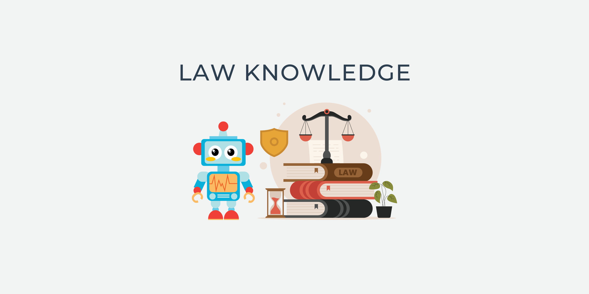
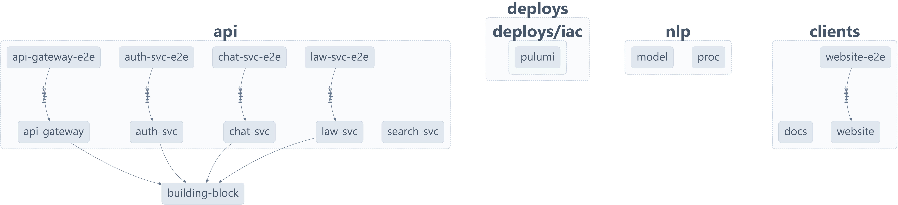

<p align="center">
	
</p>

<h1 align="center">Law Knowlege</h1>

<p align="center">
	A legal knowledge search and Q&A application based on Vietnam's Legal Code and legal document database
<p>

<p align="center">
  <a href="https://foxminchan.github.io/LawKnowledge/" rel="dofollow" target="blank"><strong>Explore the docs »</strong></a>
	<br/>
	<br/>
	<a href="https://github.com/foxminchan/LawKnowledge/issues/new?assignees=&labels=&projects=&template=bug_report.md&title=%F0%9F%90%9B+Bug+Report%3A+">🐛 Report Bug</a>
	|
	<a href="https://github.com/foxminchan/LawKnowledge/issues/new?assignees=&labels=&projects=&template=feature_request.md&title=%F0%9F%9A%80+Feature%3A+">✈️ Request Feature</a>
	|
	<a href="https://t.me/+bz74heXQgBwwOWRl">💬 Join Our Telegram</a>
	|
	<a href="https://github.com/foxminchan/LawKnowledge/wiki">📚 Read Wiki</a>
	|
	<a href="https://github.com/users/foxminchan/projects/8">📋 Roadmap</a>
</p>

<p align="center">
	<a href="https://github.com/foxminchan/LawKnowledge/issues" target="blank">
		
	</a>
	<a href="https://github.com/foxminchan/LawKnowledge/blob/main/LICENSE" target="blank">
		
	</a>
	<a href="https://colab.research.google.com/drive/1HcL3VrdKhQ1f4ZxbYOhiw_kYTtxRlT_f?usp=sharing" target="_blank">
		
	</a>
	<a href="https://gitpod.io/new/#https://github.com/foxminchan/LawKnowledge" target="_blank">
		
	</a>
	<a href="https://t.me/+bz74heXQgBwwOWRl" target="_blank">
		
	</a>
</p>


<br/>

<p align="justify">

⚙️ This project used **SonarCloud** to analyze the code quality of the project. **Pulumi** for infrastructure as code (IaC). The badge below shows the quality of the code. Click on the badge to see the details.

</p>

<br/>

<p align="center">
	<a href="https://sonarcloud.io/summary/new_code?id=foxminchan_LawKnowledge" target="blank">
		
	</a>
	<a href="https://app.pulumi.com/new?template=https://github.com/foxminchan/LawKnowledge/tree/main/deploys/iac/pulumi" target="blank">
		
	</a>
</p>

<h1>Features</h1>

- 📖 Document Organization and Linking
- 📦 Terminology Extraction
- 🔍 Quick Search for Related Content
- 🤖 User Query Support

<h1>Table of Contents</h1>

<details>
<summary>Expand contents</summary>

- [What is Law Knowledge?](#what-is-law-knowledge)
- [Tentative technologies](#tentative-technologies)
- [Building blocks](#building-blocks)
- [Getting Started](#getting-started)
	- [🛠️ Prerequisites](#️-prerequisites)
		- [Infrastucture](#infrastucture)
		- [Services](#services)
	- [😄 HuggingFace Resources](#-huggingface-resources)
	- [🧑‍💻 Setup](#-setup)
	- [🚀 Running](#-running)
	- [🧪 Testing](#-testing)
	- [🧩 Other](#-other)
- [Dependency Graph](#dependency-graph)
- [CI/CD](#cicd)
- [Contributing](#contributing)
	- [📖 Contributing Guidelines](#-contributing-guidelines)
	- [💁 Want to Help?](#-want-to-help)
	- [🫂 Code of Conduct](#-code-of-conduct)
- [Support and Organization](#support-and-organization)
- [License](#license)

</details>

# What is Law Knowledge?

<p align="justify">
Law Knowledge is an app designed to provide quick access to Vietnam's legal information, including laws and legal documents. It's ideal for professionals, students, or anyone needing insights into Vietnamese legal codes and regulations.
</p>

<blockquote>
	<p align="justify">
		<b>Law Knowledge</b> is a legal knowledge search and Q&A application based on Vietnam's Legal Code and legal document database.
	</p>
</blockquote>

If you want to find out more about the contest, please visit the [VFOSSA website](https://vfossa.vn/tin-tuc/de-thi-phan-mem-nguon-mo-olp-2023-688.html).



# Tentative technologies

- [React](https://reactjs.org/)
- [NestJS](https://nestjs.com/)
- [Python](https://www.python.org/)
- [Pulumi](https://www.pulumi.com/)
- [Kafka](https://kafka.apache.org/)
- [ArgoCD](https://argoproj.github.io/argo-cd/)
- [Jenkins](https://www.jenkins.io/)
- [Kubernetes](https://kubernetes.io/)
- [OpenTelemetry](https://opentelemetry.io/)
- [Grafana](https://grafana.com/), [Prometheus](https://prometheus.io/), [Zipkin](https://zipkin.io/), [Fluentd](https://www.fluentd.org/)

# Building blocks

<p align="justify">
We used <b>Microservice Architecture</b> to build this project to make it easier to scale and maintain. The following diagram shows the architecture of the project.
</p>


# Getting Started

## 🛠️ Prerequisites

### Infrastucture

<ul>
	<li align="justify">
		<b><a href="https://nx.dev/" target="_blank">Nx</a></b> - Nx is a set of extensible dev tools for monorepos.
	</li>
	<li align="justify">
		<b><a href="https://nodejs.org/en/" target="_blank">Nodejs</a></b> - Node.js® is a JavaScript runtime built on Chrome's V8 JavaScript engine.
	</li>
	<li align="justify">
		<b><a href="https://www.npmjs.com/" target="_blank">pnpm</a></b> - Fast, disk space efficient package manager.
	</li>
	<li align="justify">
		<b><a href="https://www.python.org/" target="_blank">Python</a></b> - Python is a programming language that lets you work quickly and integrate systems more effectively.
	</li>
	<li align="justify">
		<b><a href="https://python-poetry.org/" target="_blank">Poetry</a></b> - Poetry helps you declare, manage and install dependencies of Python projects, ensuring you have the right stack everywhere.
	</li>
	<li align="justify">
		<b><a href="https://www.pulumi.com/" target="_blank">Pulumi</a></b> - Pulumi is a manage infrastructure, secrets, and configurations intuitively on any cloud.
	</li>
	<li align="justify">
		<b><a href="https://www.docker.com/" target="_blank">Docker (Kubernetes Enabled)</a></b> - Docker is an open platform for developing, shipping, and running applications.
	</li>
	<li align="justify">
		<b><a href="https://helm.sh/" target="_blank">Helm</a></b> - Helm is the best way to find, share, and use software built for Kubernetes.
	</li>
</ul>

### Services

<ul>
	<li align="justify">
		<b><a href="https://aws.amazon.com/" target="_blank">AWS</a></b> - An Amazon Web Services account is required to deploy the infrastructure.
	</li>
	<li align="justify">
		<b><a href="https://huggingface.co/" target="_blank">HuggingFace</a></b> - A HuggingFace account is required to download and upload the dataset and model.
	</li>
</ul>

## 😄 HuggingFace Resources

<p align="justify">

You can download the dataset from the following link:

- [Law Knowledge Data](https://huggingface.co/datasets/foxminchan/law-knowledge): The dataset from [Pháp điển](https://phapdien.moj.gov.vn/) and [Văn bản pháp luật](https://vbpl.vn/).
- [Law Knowledge Model](https://huggingface.co/foxminchan/law-knowledge): A fine-tuned model from [PhoBERT](https://huggingface.co/vinai/phobert-base-v2).

</p>

## 🧑‍💻 Setup

First, clone the repository to your local machine:

```bash
git clone https://github.com/foxminchan/LawKnowledge
```

Next, navigate to the root directory of the project and install the dependencies:

```bash
pnpm install --force
```

## 🚀 Running

For the website, you can run the following command:

```bash
npx nx serve website --prod
```

For the API, you can run the following command:

```bash
# For the API Gateway
npx nx serve api-gateway --prod

# For the Auth Service
npx nx serve auth-svc --prod

# For the Law Service
npx nx serve law-svc --prod

# For the Search Service, navigate to the search-svc directory
npx nx build search-svc && cd apps/api/search-svc/search-svc && python main.py

# For the Chat Service, navigate to the chat-svc directory
npx nx build chat-svc && cd apps/api/chat-svc/chat-svc && python main.py
```

To traning the model, you can run the following command:

```bash
npx nx build bert && cd apps/nlp/bert/bert && python main.py
```

To set up the infrastructure, you can run the following command:

```bash
npx nx up pulumi
```

> [!IMPORTANT]
>
> <p align="justify">
> If you want to run with Nx, make sure you have installed `poetry` globally. Python version must be `>=3.9.1 <=3.12`.
> </p>

## 🧪 Testing

For the website, you can run the following command:

```bash
npx nx test website-e2e
```

For the API, you can run the following command:

```bash
# For the API Gateway
npx nx test api-gateway-e2e

# For the Auth Service
npx nx test auth-svc-e2e

# For the Law Service
npx nx test law-svc-e2e

# For the Search Service
npx nx test search-svc-e2e

# For the Chat Service
npx nx test chat-svc
```

To test the model, you can run the following command:

```bash
npx nx test bert
```

## 🧩 Other

To run the tooling for processing the dataset, you can run the following command:

```bash
npx nx build processor && cd apps/nlp/processor/processor && python main.py
```

For running documentation, you can run the following command:

```bash
npx nx serve docs
```

Some useful scripts:

```bash
# Navigate to the scripts directory
cd tools/scripts && ls

# + scripts
# +-- build.sh --> Build the project
# +-- clean.sh --> Clean the docker image
# +-- init.sh --> Initialize the project
# +-- prepare.sh --> Prepare the project
# +-- start.sh --> Start the project
# +-- start-o11y.sh --> Start the observability stack
# +-- stop-o11y.sh --> Stop the observability stack

# Run the script
./<script-name>
```

# Dependency Graph

You can see the dependency graph of the project by running the following command:

```bash
npx nx dep-graph
```

Here is the dependency graph of the project:



# CI/CD


# Contributing

## 📖 Contributing Guidelines

<p align="justify">

We are excited that you are interested in contributing to this project! Before submitting your contribution, please make sure to take a moment and read through the following guidelines:

Read through our [contributing guidelines](.github/CONTRIBUTING.md) to learn about our submission process, coding rules, and more.

</p>

## 💁 Want to Help?

<p align="justify">

Want to report a bug, contribute some code, or improve the documentation? Excellent! Read up on our guidelines for [contributing](.github/CONTRIBUTING.md) and then check out one of our issues labeled as <kbd>[help wanted](https://github.com/foxminchan/LawKnowledge/labels/help%20wanted)</kbd> or <kbd>[good first issue](https://github.com/foxminchan/LawKnowledge/labels/good%20first%20issue)</kbd>.

</p>

## 🫂 Code of Conduct

<p align="justify">

Help us keep Law Knowledge open and inclusive. Please read and follow our [Code of Conduct](.github/CODE_OF_CONDUCT.md).

</p>

# Support and Organization

<p align="center">
	<a href="https://hutech.edu.vn/" target="_blank">
		
	</a>
	<a href="https://vfossa.vn/" target="_blank">
		
	</a>
	<a href="http://husc.hueuni.edu.vn/" target="_blank">
		
	</a>
	<a href="https://olp.husc.edu.vn/" target="_blank">
		
	</a>
</p>

# License

<p align="justify">

This project is licensed under the terms of the [MIT](LICENSE) license.

</p>
