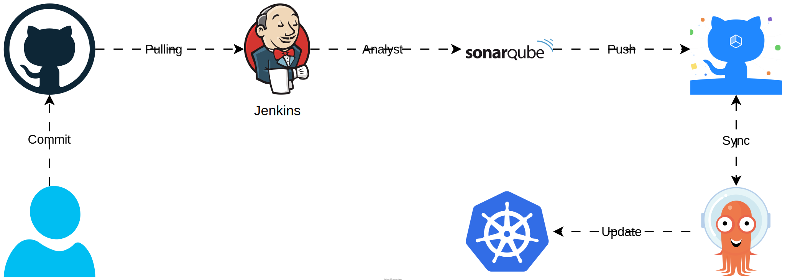

<p align="center">
	
</p>

<h1 align="center">Law Knowlege</h1>

<p align="center">
	A legal knowledge search and Q&A application based on Vietnam's Legal Code and legal document database
<p>

<p align="center">
  <a href="https://foxminchan.github.io/LawKnowledge/" rel="dofollow" target="blank"><strong>Explore the docs »</strong></a>
	<br/>
	<br/>
	<a href="https://github.com/foxminchan/LawKnowledge/issues/new?assignees=&labels=&projects=&template=bug_report.md&title=%F0%9F%90%9B+Bug+Report%3A+">🐛 Report Bug</a>
	|
	<a href="https://github.com/foxminchan/LawKnowledge/issues/new?assignees=&labels=&projects=&template=feature_request.md&title=%F0%9F%9A%80+Feature%3A+">✈️ Request Feature</a>
	|
	<a href="https://t.me/+bz74heXQgBwwOWRl">💬 Join Our Telegram</a>
	|
	<a href="https://github.com/foxminchan/LawKnowledge/wiki">📚 Read Wiki</a>
	|
	<a href="https://github.com/users/foxminchan/projects/8">📋 Roadmap</a>
</p>

<p align="center">
	<a href="https://github.com/foxminchan/LawKnowledge/issues" target="blank">
		
	</a>
	<a href="https://github.com/foxminchan/LawKnowledge/blob/main/LICENSE" target="blank">
		
	</a>
	<a href="https://gitpod.io/new/#https://github.com/foxminchan/LawKnowledge" target="_blank">
		
	</a>
		<a href="https://t.me/+bz74heXQgBwwOWRl" target="_blank">
		
	</a>
</p>


<br/>

<p align="justify">

⚙️ This project used **SonarCloud** to analyze the code quality of the project. **Pulumi** for infrastructure as code (IaC). The badge below shows the quality of the code. Click on the badge to see the details.

</p>

<br/>

<p align="center">
	<a href="https://sonarcloud.io/summary/new_code?id=foxminchan_LawKnowledge" target="blank">
		
	</a>
	<a href="https://app.pulumi.com/new?template=https://github.com/foxminchan/LawKnowledge/tree/main/deploys/iac" target="blank">
		
	</a>
</p>

<h1>Features</h1>

- 📖 Document Organization and Linking
- 📦 Terminology Extraction
- 🔍 Quick Search for Related Content
- 🤖 User Query Support

<h1>Table of Contents</h1>

<details>
<summary>Expand contents</summary>

- [What is Law Knowledge?](#what-is-law-knowledge)
- [Tentative technologies](#tentative-technologies)
- [Building blocks](#building-blocks)
- [Getting Started](#getting-started)
  - [🛠️ Prerequisites](#️-prerequisites)
  - [📦 Dataset](#-dataset)
  - [🧑‍💻 Setup](#-setup)
  - [🚀 Running](#-running)
  - [🧪 Testing](#-testing)
  - [🧩 Other](#-other)
- [Dependency Graph](#dependency-graph)
- [CI/CD](#cicd)
- [Contributing](#contributing)
  - [📖 Contributing Guidelines](#-contributing-guidelines)
  - [💁 Want to Help?](#-want-to-help)
  - [🫂 Code of Conduct](#-code-of-conduct)
- [Contributer](#contributer)
- [Support and Organization](#support-and-organization)
- [License](#license)

</details>

# What is Law Knowledge?

<p align="justify">
Law Knowledge is an app designed to provide quick access to Vietnam's legal information, including laws and legal documents. It's ideal for professionals, students, or anyone needing insights into Vietnamese legal codes and regulations.

> This project is part of the 2023 open source software competition hosted by the Vietnam Free and Open Source Software Association (VFOSSA).

If you want to find out more about the contest, please visit the [VFOSSA website](https://vfossa.vn/tin-tuc/de-thi-phan-mem-nguon-mo-olp-2023-688.html).

</p>


# Tentative technologies

- [React](https://reactjs.org/)
- [NestJS](https://nestjs.com/)
- [FastAPI](https://fastapi.tiangolo.com/)
- [Pulumi](https://www.pulumi.com/)
- [Kafka](https://kafka.apache.org/)
- [ArgoCD](https://argoproj.github.io/argo-cd/)
- [Jenkins](https://www.jenkins.io/)
- [OpenStack](https://www.openstack.org/)
- [Kubernetes](https://kubernetes.io/)
- [SonarCloud](https://sonarcloud.io/)
- [OpenTelemetry](https://opentelemetry.io/)
- [Grafana](https://grafana.com/), [Prometheus](https://prometheus.io/), [Loki](https://grafana.com/oss/loki/), [Tempo](https://grafana.com/oss/tempo/), [Promtail](https://grafana.com/docs/loki/latest/send-data/promtail/)

# Building blocks

<p align="justify">

We used **Microservice Architecture** to build this project to make it easier to scale and maintain. The following diagram shows the architecture of the project.

</p>


# Getting Started

## 🛠️ Prerequisites

<ul>
	<li align="justify">
		<b><a href="https://nx.dev/" target="_blank">Nx</a></b> - Nx is a set of extensible dev tools for monorepos.
	</li>
	<li align="justify">
		<b><a href="https://nodejs.org/en/" target="_blank">Nodejs</a></b> - Node.js® is a JavaScript runtime built on Chrome's V8 JavaScript engine.
	</li>
	<li align="justify">
		<b><a href="https://www.npmjs.com/" target="_blank">pnpm</a></b> - Fast, disk space efficient package manager.
	</li>
	<li align="justify">
		<b><a href="https://www.python.org/" target="_blank">Python</a></b> - Python is a programming language that lets you work quickly and integrate systems more effectively.
	</li>
	<li align="justify">
		<b><a href="https://python-poetry.org/" target="_blank">Poetry</a></b> - Poetry helps you declare, manage and install dependencies of Python projects, ensuring you have the right stack everywhere.
	</li>
	<li align="justify">
		<b><a href="https://www.pulumi.com/" target="_blank">Pulumi</a></b> - Pulumi is a manage infrastructure, secrets, and configurations intuitively on any cloud.
	</li>
	<li align="justify">
		<b><a href="https://www.docker.com/" target="_blank">Docker (Kubernetes Enabled)</a></b> - Docker is an open platform for developing, shipping, 	and running applications.
	</li>
	<li align="justify">
		<b><a href="https://helm.sh/" target="_blank">Helm</a></b> - Helm is the best way to find, share, and use software built for Kubernetes.
	</li>
</ul>

## 📦 Dataset

<p align="justify">

You can download the dataset from the following link:

- [Phap Dien](https://phapdien.moj.gov.vn/Pages/home.aspx): A website that provides legal documents of Vietnam.
- [QPPL](https://vbpl.vn/pages/portal.aspx): Database of Vietnam's legal documents.

</p>

## 🧑‍💻 Setup

First, clone the repository to your local machine:

```bash
git clone https://github.com/foxminchan/LawKnowledge
```

Next, navigate to the root directory of the project and install the dependencies:

```bash
pnpm install --force
```

## 🚀 Running

For the website, you can run the following command:

```bash
npx nx serve website
```

For the API, you can run the following command:

```bash
# For the API Gateway
npx nx serve api-gateway

# For the Auth Service
npx nx serve api-auth-svc

# For the Law Service
npx nx serve api-law-svc

# For the Chat Service
npx nx serve api-chat-svc

# For the Search Service
npx nx build api-search-svc
```

To traning the model, you can run the following command:

```bash
npx nx build model
```

To set up the infrastructure, you can run the following command:

```bash
npx nx up iac
```

<p align="justify">

> [!IMPORTANT]
> If you want to run with Nx, make sure you have installed `poetry` globally. Python version must be `>=3.9 <=3.12`.

</p>

## 🧪 Testing

For the website, you can run the following command:

```bash
npx nx test website
```

For the API, you can run the following command:

```bash
# For the API Gateway
npx nx test api-gateway

# For the Auth Service
npx nx test api-auth-svc

# For the Law Service
npx nx test api-law-svc

# For the Search Service
npx nx test api-search-svc

# For the Chat Service
npx nx test api-chat-svc
```

To test the model, you can run the following command:

```bash
npx nx test model
```

## 🧩 Other

To run the tooling for processing the dataset, you can run the following command:

```bash
npx nx serve auto
```

For running documentation, you can run the following command:

```bash
npx nx serve docs
```

# Dependency Graph

You can see the dependency graph of the project by running the following command:

```bash
npx nx dep-graph
```

Here is the dependency graph of the project:


# CI/CD



# Contributing

## 📖 Contributing Guidelines

<p align="justify">

We are excited that you are interested in contributing to this project! Before submitting your contribution, please make sure to take a moment and read through the following guidelines:

Read through our [contributing guidelines](.github/CONTRIBUTING.md) to learn about our submission process, coding rules, and more.

</p>

## 💁 Want to Help?

<p align="justify">

Want to report a bug, contribute some code, or improve the documentation? Excellent! Read up on our guidelines for [contributing](.github/CONTRIBUTING.md) and then check out one of our issues labeled as <kbd>[help wanted](https://github.com/foxminchan/LawKnowledge/labels/help%20wanted)</kbd> or <kbd>[good first issue](https://github.com/foxminchan/LawKnowledge/labels/good%20first%20issue)</kbd>.

</p>

## 🫂 Code of Conduct

Help us keep Law Knowledge open and inclusive. Please read and follow our [Code of Conduct](.github/CODE_OF_CONDUCT.md).

# Contributer

Thanks goes to these wonderful people ([emoji key](https://allcontributors.org/docs/en/emoji-key))

<div align="center">
	<table>
		<tr>
			<td align="center" valign="top">
					
	        <br>
	        <a href="https://github.com/foxminchan">Xuan Nhan</a>
	        <p>
	          <a href="https://github.com/HutechCJ/ProfioApp/commits?author=foxminchan" title="Developer">💻</a>
	          <a href="#docs" title="Documentation">📖</a>
	          <a href="#infra" title="Infrastructure">🚇</a>
						<a href="#mentoring" title="Mentoring">🧑‍🏫</a>
	        </p>
			</td>
			<td align="center" valign="top">
					
	        <br>
	        <a href="https://github.com/baohuy2k3">Bao Huy</a>
	        <p>
	          <a href="https://github.com/foxminchan/LawKnowledge/commits?author=baohuy2k3" title="Developer">💻</a>
						<a href="#data" title="Data">🔣</a>
						<a href="#design" title="Design">🎨</a>
	        </p>
			</td>
			<td align="center" valign="top">
					
	        <br>
	        <a href="https://github.com/NguyenTriBaoThang">Bao Thang</a>
	        <p>
	          <a href="https://github.com/foxminchan/LawKnowledge/commits?author=NguyenTriBaoThang" title="Developer">💻</a>
						<a href="#design" title="Design">🎨</a>
	        </p>
			</td>
		</tr>
	</table>
</div>

# Support and Organization

<p align="center">
	<a href="https://hutech.edu.vn/" target="_blank">
		
	</a>
	<a href="https://vfossa.vn/" target="_blank">
		
	</a>
	<a href="http://husc.hueuni.edu.vn/" target="_blank">
		
	</a>
	<a href="https://olp.husc.edu.vn/" target="_blank">
		
	</a>
</p>

# License

<p align="justify">

This project is licensed under the terms of the [MIT](LICENSE) license.

</p>
