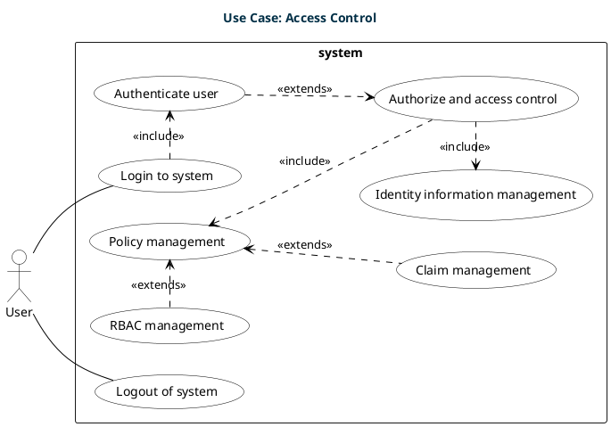
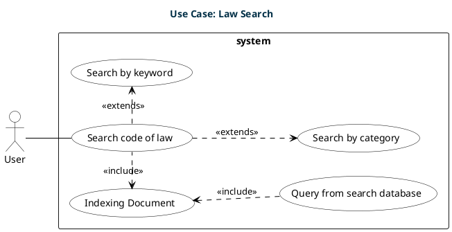
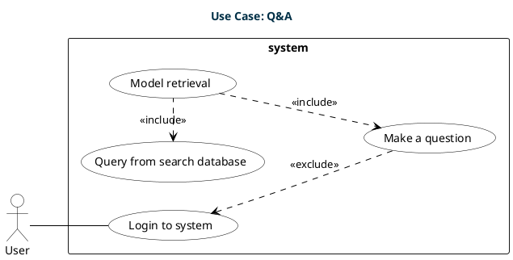

# Usecase View

## Overview

  The use case view is a visual representation of the interactions of actors
  with a system. It is a collection of use cases, actors, and their
  relationships. The use case view is used to describe the functional
  requirements of the system. It is also used to capture the requirements of a
  system, that is, what a system is supposed to do. The use case view is also
  used to capture the functional requirements of a system, that is, what a
  system is supposed to do.

## Access Control

<table>
  <tr>
    <th align="left">Use Case</th>
    <th align="justify">Description</th>
  </tr>
  <tr>
    <td align="left">1. Login to system</td>
    <td align="justify">Initiates the user authentication process.</td>
  </tr>
  <tr>
    <td align="left">2. Authenticate user</td>
    <td align="justify">
      Included in the login process for user identity verification.
    </td>
  </tr>
  <tr>
    <td align="left">3. Authorize and access control</td>
    <td align="justify">
      Manages user permissions post-authentication, extending from
      authentication.
    </td>
  </tr>
  <tr>
    <td align="left">4. Policy management</td>
    <td align="justify">
      Included in authorization; handles rules and policies for access control.
    </td>
  </tr>
  <tr>
    <td align="left">5. Identity information management</td>
    <td align="justify">
      Part of authorization; manages user identity details.
    </td>
  </tr>
  <tr>
    <td align="left">6. RBAC (Role-Based Access Control) management</td>
    <td align="justify">
      Deals with access control based on user roles, extending policy
      management.
    </td>
  </tr>
  <tr>
    <td align="left">7. Claim management</td>
    <td align="justify">
      Likely involves handling user claims for resource access, extending policy
      management.
    </td>
  </tr>
  <tr>
    <td align="left">8. Logout of system</td>
    <td align="justify">Process for a user to exit the system securely.</td>
  </tr>
</table>

## Law Search

<table>
  <tr>
    <th align="left">Use Case</th>
    <th align="justify">Description</th>
  </tr>
  <tr>
    <td align="left">1. Search code of law</td>
    <td align="justify">
      The primary action where a User searches for legal codes or documents.
    </td>
  </tr>
  <tr>
    <td align="left">2. Indexing Document</td>
    <td align="justify">
      A process included in the search, likely involving organizing and
      preparing legal documents for searchability.
    </td>
  </tr>
  <tr>
    <td align="left">3. Search by keyword</td>
    <td align="justify">
      An extension of the main search use case; allows searching based on
      specific keywords.
    </td>
  </tr>
  <tr>
    <td align="left">4. Search by category</td>
    <td align="justify">
      Another extension of the main search use case; facilitates searching based
      on predefined legal categories.
    </td>
  </tr>
  <tr>
    <td align="left">5. Query from search database</td>
    <td align="justify">
      Included in the process of Indexing Document; involves retrieving data
      from a search database as part of the indexing process.
    </td>
  </tr>
</table>

## Q&A

<table>
  <tr>
    <th align="left">Use Case</th>
    <th align="justify">Description</th>
  </tr>
  <tr>
    <td align="left">1. Login to system</td>
    <td align="justify">The initial step where a User logs into the system.</td>
  </tr>
  <tr>
    <td align="left">2. Make a question</td>
    <td align="justify">The core action where a User poses a question.</td>
  </tr>
  <tr>
    <td align="left">3. Model retrieval</td>
    <td align="justify">
      A process included in making a question; possibly involves retrieving
      relevant information or models to answer the question.
    </td>
  </tr>
  <tr>
    <td align="left">4. Query from search database</td>
    <td align="justify">
      Included in the process of Model retrieval; entails retrieving data from a
      database to assist in answering the question.
    </td>
  </tr>
</table>
